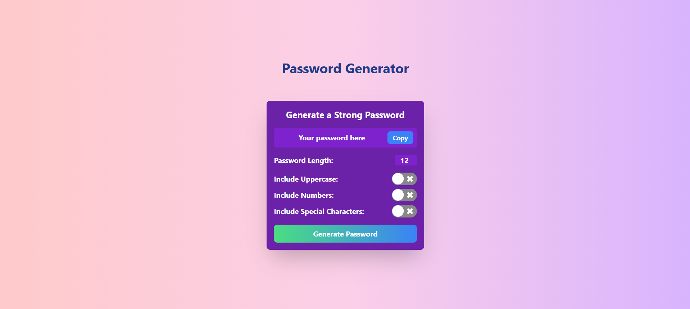

# Password Generator

A simple and customizable password generator built using React and styled with Tailwind CSS. It allows users to generate strong passwords with various customization options.

## Preview

Below is a preview of the Password Generator in action:

## Features
- ✅ Adjustable password length  
- ✅ Toggle options for uppercase letters, numbers, and special characters  
- ✅ One-click password copy button  
- ✅ Real-time password generation  
- ✅ Responsive and modern UI  

## Getting Started

### Installation
1. Clone the repository  
`git clone https://github.com/mannatgupta146/Password-Generator.git`
2. Navigate to the project directory  
`cd Password-Generator`
3. Install dependencies  
`npm install`

### Usage
- **Start Development Server:**  
`npm start`
Runs the app in development mode at **http://localhost:3000**  

- **Build for Production:**  
`npm run build`
Generates an optimized build in the `/build` folder  

### Deployment
This project is deployed using GitHub Pages.  

Live at: [https://mannatgupta146.github.io/Password-Generator](https://mannatgupta146.github.io/Password-Generator)

## Technologies Used
- ⚡ **React** – For building the UI  
- 🎨 **Tailwind CSS** – For styling  
- 🔄 **React Switch** – For toggle buttons  
- 🚀 **GitHub Pages** – For deployment  

## Contributing
Contributions are welcome! If you’d like to improve this project, feel free to fork the repository and create a pull request.

---
***Generate your password!***
